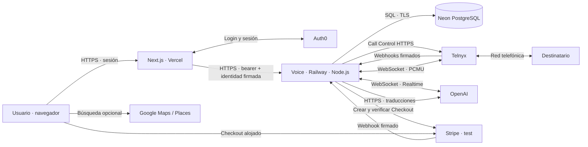
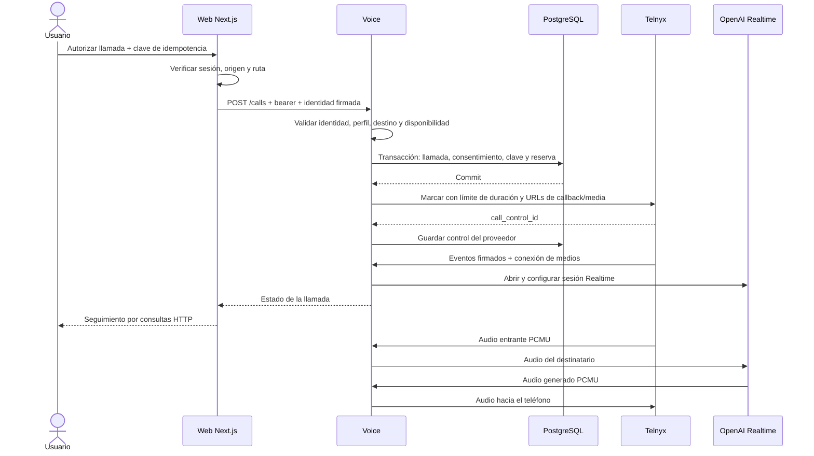
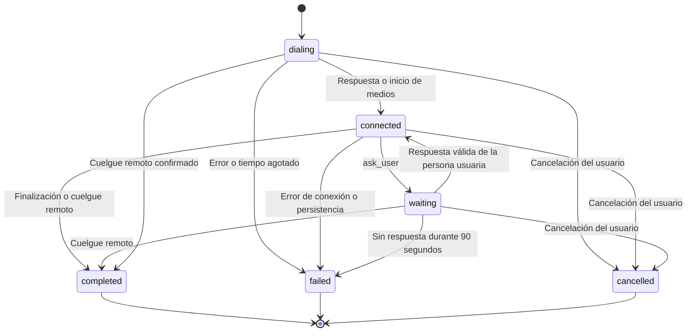
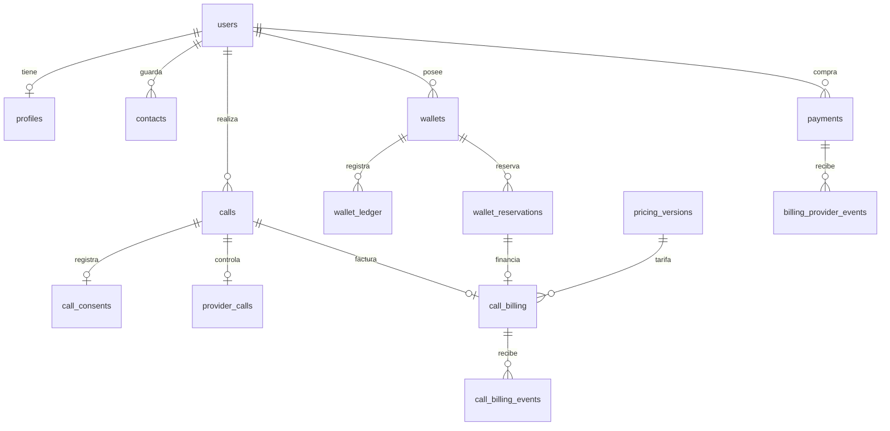

# Arquitectura y funcionamiento

Descripción del código actual, no de una arquitectura futura. Para contexto funcional, ver [el proyecto](PROJECT.md); para las rutas concretas, [API](API.md).

## 1. Topología

Hay dos vías distintas:

- **Control y estado:** navegador → Next.js → API de voz → PostgreSQL. La interfaz consulta periódicamente el estado; no recibe el audio ni abre el WebSocket de Telnyx. El panel consulta cada 5 segundos en primer plano y el detalle activo cada 1,2 segundos; las pestañas ocultas reducen esa frecuencia.
- **Audio:** teléfono ↔ Telnyx ↔ worker ↔ OpenAI Realtime. Los sockets permanecen abiertos en el worker mientras dura la llamada. Las traducciones de texto se solicitan aparte y no se vuelven a introducir como conversación telefónica.

Vercel sirve la web. El contenedor de Railway ejecuta únicamente `node --import tsx server/index.ts`, sin Next.js ni React. Se conserva un dominio HTTPS estable para API, callbacks y medios.

## 2. Mapa del código

| Pieza | Archivo | Responsabilidad |
| --- | --- | --- |
| Entrada HTTP y WebSocket | [server/index.ts](../server/index.ts) | Rutas, autenticación, callbacks, arranque, bloqueo exclusivo y apagado |
| Puerto e interfaz | [server/listener.ts](../server/listener.ts) | Prioridad `PORT` → `VOICE_PORT` → 3001; host local por defecto |
| Motor de llamada | [server/engine.ts](../server/engine.ts) | Sesiones, audio, preguntas, transcripciones, finalización y recuperación |
| Adaptadores y herramientas | [server/providers.ts](../server/providers.ts) | Telnyx, Responses, instrucciones del agente, `ask_user` y `finish_call` |
| Validación de seguridad | [server/security.ts](../server/security.ts) | Firma Telnyx, comparación de tokens, disponibilidad y destinos |
| Persistencia de negocio | [server/store.ts](../server/store.ts) | Usuarios, perfiles, llamadas, contactos, idempotencia y controles del proveedor |
| Conexiones y transacciones | [server/database.ts](../server/database.ts), [transaction.ts](../server/transaction.ts) | Conexión directa/pool, TLS y commit/rollback |
| Pagos | [server/billing/payments.ts](../server/billing/payments.ts) | Checkout, deduplicación y confirmación del crédito |
| Adaptador Stripe | [server/billing/stripe/index.ts](../server/billing/stripe/index.ts) | Verificación de objetos, precios y firmas |
| Saldo y tarifa | [server/wallet/index.ts](../server/wallet/index.ts), [pricing/index.ts](../server/pricing/index.ts) | Libro contable, reservas y cálculo entero del cargo |
| Liquidación de llamadas | [server/calls/billing.ts](../server/calls/billing.ts) | Evidencia Telnyx, duración conectada, captura y liberación |
| Contrato compartido | [lib/types.ts](../lib/types.ts), [validation.ts](../lib/validation.ts), [internal-identity.ts](../lib/internal-identity.ts) | Tipos, esquemas e identidad firmada |
| Esquema y herramientas | [db/migrations](../db/migrations), [scripts](../scripts) | Migración, importación heredada, backup y conciliación |

## 3. Cómo se inicia una llamada

El diagrama representa el orden lógico; los webhooks pueden llegar antes de la respuesta de marcado y pueden repetirse o llegar fuera de orden.

Antes de marcar, una transacción bloquea el usuario, comprueba la idempotencia y el perfil, impide otra llamada activa, aplica el intervalo mínimo de 30 segundos y registra consentimiento y reserva. El saldo disponible se reserva completo para esa llamada. La duración máxima se calcula con el saldo y la tarifa, limitada además por `MAX_CALL_SECONDS` (600 por defecto; rango 30–1200).

La solicitud a Telnyx incluye `command_id` igual al ID de la llamada, correlación `client_state`, límite de duración y un token aleatorio específico para el socket de medios. El control recibido se persiste para poder colgar incluso después de perder la sesión en memoria.

## 4. Conversación, aprobaciones y estados

Es un resumen de las transiciones habituales, no una enumeración de todos los eventos. Un reinicio convierte cualquier llamada activa anterior en `failed` con `SERVER_RESTART`.

`completed` indica que terminó el ciclo de llamada; **no equivale a objetivo conseguido**. `result.outcome` distingue `success`, `incomplete`, `cancelled` y `failed`. El estado financiero es independiente: `reserved`, `pending` o `settled`.

`ask_user` crea una pregunta con ID y tipo `information` o `approval`. La llamada pasa a `waiting`, conserva los sockets y espera una respuesta que incluya ese mismo ID. El backend rechaza respuestas repetidas o antiguas. El resultado provisional de la herramienta es `pending`, nunca una aprobación.

Durante la espera no se continúa la conversación normal. Si el destinatario habla, el servidor permite un mensaje breve de espera con un intervalo mínimo de 15 segundos. Si la persona usuaria no contesta en 90 segundos, termina la llamada. Una respuesta válida se inserta como información privada en la sesión existente; no se marca de nuevo.

`finish_call` valida el resumen, impide finalizar mientras hay una pregunta pendiente y deja tiempo para reproducir la despedida antes de colgar. Las instrucciones piden al agente identificarse como IA y respetar las restricciones del usuario; estas instrucciones de comportamiento no son una garantía de que el modelo nunca se equivoque.

## 5. Audio y transcripciones

El worker acepta PCMU a 8 kHz. De Telnyx solo reenvía la pista entrante del destinatario; evita alimentar al modelo con su propia salida. La sesión Realtime usa detección de voz, pero el motor controla explícitamente la creación de respuestas para evitar respuestas simultáneas.

Si el destinatario interrumpe, el motor vacía la reproducción pendiente en Telnyx, trunca el segmento correspondiente en la conversación de OpenAI y marca la transcripción como interrumpida. Las colas y los buffers tienen límites; una presión excesiva termina la llamada con error en lugar de acumular audio indefinidamente.

Las transcripciones del destinatario y del agente se guardan con sus identificadores. Una petición de texto separada obtiene traducciones al español e inglés mediante un esquema JSON. Un fallo de traducción conserva el original. Si la traducción llega después de terminar la llamada, se actualiza solo esa entrada en PostgreSQL sin restaurar un estado activo antiguo.

Los modelos por defecto y la configuración de sesión están en [providers.ts](../server/providers.ts) y [engine.ts](../server/engine.ts); son valores de esta implementación, no una recomendación sobre los modelos disponibles en el proveedor.

## 6. Persistencia y dinero

El diagrama muestra relaciones principales; los SQL de [migraciones](../db/migrations) incluyen todas las restricciones, índices, vistas y tablas auxiliares. Perfiles y contenido de llamadas usan JSONB; identidad, propiedad, estados e importes tienen columnas relacionales. No se guarda audio en tablas ni archivos.

PostgreSQL es la fuente duradera. Las sesiones, sockets, timers y tokens de medios viven en memoria. Las escrituras de cada llamada se serializan para que eventos y traducciones no sobrescriban una versión más nueva.

Una recarga sigue este recorrido:

1. El backend crea un pago con paquete/precio confiables y clave de idempotencia; solicita una sesión de Checkout.
2. El usuario completa Checkout alojado. El retorno al navegador solo consulta el estado; no acredita dinero.
3. El webhook Stripe verifica su firma y recupera la confirmación del proveedor. Se comprueban pago, usuario, paquete, precio, moneda, cantidad e importe.
4. Una transacción deduplica el evento, confirma el pago, añade el crédito al libro contable y registra el evento de outbox.

Al terminar una llamada, los eventos firmados `call.answered` y `call.hangup` permiten calcular los segundos conectados. El cargo se calcula con enteros: `ceil(segundos × tarifa_por_minuto / 60)`, limitado al presupuesto reservado. La tarifa queda fijada al iniciar la llamada. El código descarta el resto inferior a un segundo y no cobra el tiempo de timbrado.

La liquidación captura el cargo y libera el resto. Si falta evidencia, mantiene la reserva para conciliación; no inventa una duración a partir del reloj del navegador. `outbox_events` conserva hechos transaccionales, pero todavía no hay un consumidor que los entregue a otro sistema. Ver [facturación](BILLING.md).

## 7. Límites de confianza

| Frontera | Control implementado |
| --- | --- |
| Navegador → web | Sesión Auth0; comprobación de Host/origen, JSON y rutas permitidas |
| Web → voz | Bearer compartido + identidad HMAC con caducidad de 30 segundos, firmada por el servidor web |
| Usuario → datos | Consultas por propietario; una llamada ajena responde 404 |
| Telnyx → webhook | Firma Ed25519, timestamp dentro de cinco minutos y deduplicación persistida |
| Telnyx → medios | Token aleatorio por llamada, sesión activa y una conexión de medios autorizada |
| Stripe → webhook | Firma sobre cuerpo original y comprobación adicional de objetos e importes |
| Worker → PostgreSQL remoto | TLS con validación del certificado y SQL parametrizado |

La identidad firmada es un formato interno, no un token Auth0 ni una credencial que deba recibir el navegador. `shareProfile=false` excluye el perfil del prompt; el contexto escrito expresamente para la llamada sigue siendo parte de la tarea.

## 8. Arranque, recuperación y despliegue

El proceso abre el puerto, adquiere un advisory lock de PostgreSQL con una conexión directa, recupera llamadas anteriores y después acepta peticiones. `/healthz` devuelve 200 solo cuando acepta tráfico, no ha registrado fallos de persistencia y puede consultar la base. No prueba saldo, audio ni acceso a los proveedores.

Un segundo worker no puede obtener ese bloqueo. Esto impide que interprete las llamadas del primero como huérfanas. Por esa razón se usa **una réplica, sin suspensión y sin rolling deployments**: se detiene la instancia anterior antes de iniciar la siguiente. La URL pública no cambia.

Tras un reinicio, las llamadas previas se marcan fallidas y se intenta colgar cualquier control del proveedor pendiente. Cada 30 segundos se reintentan controles huérfanos y se limpian eventos antiguos. Una terminación no confirmada puede bloquear llamadas nuevas aunque el proceso siga saludable.

En un fallo de persistencia, el motor deja de aceptar nuevas llamadas, cierra medios e intenta colgar. En `SIGTERM`/`SIGINT`, deja de aceptar tráfico, termina sesiones y cierra las conexiones; tiene un plazo de apagado de 20 segundos. No existe transferencia de una llamada activa a otro worker.

Escalar a varios workers requeriría diseñar asignación de sesiones, enrutamiento de medios, coordinación de controles y recuperación por propietario. Aumentar réplicas sin esos cambios no es compatible con la implementación actual.

## 9. Cómo mantener esta documentación

Cambios de rutas o errores → [API](API.md). Cambios en tablas → nueva migración y [PostgreSQL](POSTGRESQL.md). Cambios financieros → [facturación](BILLING.md). Cambios de proceso, puertos o apagado → [Railway](RAILWAY.md) y [operaciones](OPERATIONS.md).

Los formatos compartidos y el catálogo público deben actualizarse coordinadamente en ambos repositorios. No hay sincronización automática de `lib/`; ver [desarrollo](DEVELOPMENT.md).
